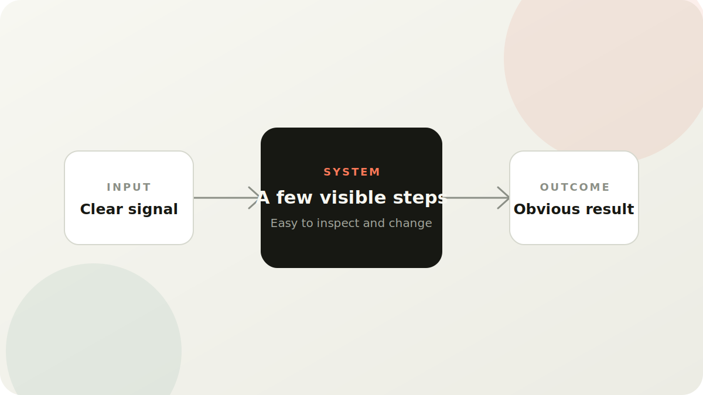

# Building Simple Systems

I try to keep my workflow simple on purpose.

Small systems are easier to understand, easier to change, and easier to trust.

## What I look for

- clear inputs
- a small number of steps
- obvious outcomes

## The goal

The goal is not to have the most advanced system. The goal is to have one I can keep using.
